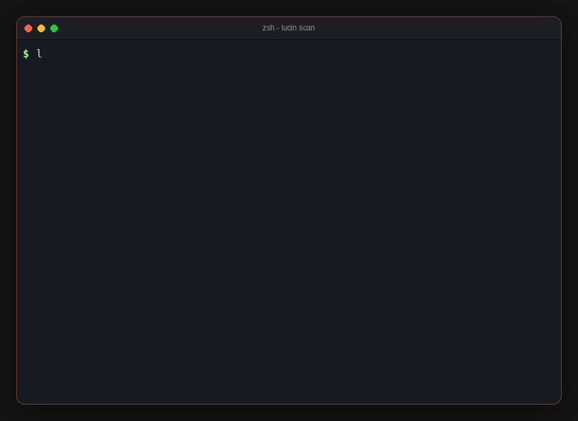

# Lucin

[](https://pypi.org/project/lucin/)
[](https://github.com/Madhav2310/lucinlabs/actions)
[](LICENSE)
[](https://pypi.org/project/lucin/)

**Find what your AI agents can do that they shouldn't — before attackers do.**

Lucin is an open-source static security scanner for AI agents. It reads the actual code inside your agent's tools — not just tool names or descriptions — and finds dangerous capability configurations before they reach production, mapped to the [OWASP Top 10 for Agentic Applications](https://genai.owasp.org/resource/agentic-ai-threats-and-mitigations/).



## Quick Start

```bash
pip install lucin
lucin scan ./my-agent/
```

No API keys. No configuration files. No account signup. Your code and findings
never leave your machine — see [Telemetry](#telemetry) for the one thing that
does (anonymous counts, on by default, one command to turn off).

## Contents

- [What It Does](#what-it-does) · [What It Finds](#what-it-finds) · [What it doesn't catch](#what-it-doesnt-catch-honesty-matters)
- [Supported Frameworks](#supported-frameworks) · [Usage](#usage) · [Security Score](#security-score) · [How It Works](#how-it-works)
- [Validated Capabilities](#validated-capabilities-reproducible) · [Red Team Engine](#red-team-engine) · [Behavioral Monitor](#behavioral-monitor-ml)
- [CI/CD Integration](#cicd-integration) · [Configuration](#configuration) · [Telemetry](#telemetry)
- [Why Lucin?](#why-lucin) · [Contributing](#contributing)

## What It Does

| Command | Purpose | Status |
|---------|---------|--------|
| `lucin scan` | Find security issues in agent tool code | ✅ Stable |
| `lucin info` | Show agent inventory without running detections | ✅ Stable |
| `lucin explain` | Explain a finding in depth (meaning, impact, fix) | ✅ Stable |
| `lucin fix` | Generate code fixes for findings | ✅ Stable |
| `lucin badge` | Security badge SVG for your README | ✅ Stable |
| `lucin discover` | Discover MCP configs across IDEs on this system | ✅ Stable |
| `lucin redteam` | Adversarial payload testing | 🧪 Experimental |
| `lucin monitor` | Behavioral deviation scoring on agent traces | 🧪 Experimental |
| `lucin serve` | REST API | 🧪 Experimental |

## What It Finds

Lucin ships **29 detector modules** (source: `src/lucin/detectors/`). **27 are
registered/active** (`from lucin.detectors import ACTIVE_DETECTOR_COUNT`); two are
intentionally held back:
- **AG-013** (memory poisoning) returns no findings — disabled pending real false-positive
  data (see note below).
- **AG-PATH-TRAVERSAL** is built, sound, and unit-tested but **intentionally unregistered**:
  the benign corpus contains byte-identical legitimate file tools (`open(param)`,
  `os.path.join(base, name)`), so registering it would break the published
  0-false-positive result (see *Validated Capabilities*). Precision over recall, by design
  (`src/lucin/detectors/__init__.py` documents the gate).

Rule IDs and severities below are read directly from the detector source (`grep -rhoE
'id="AG-[A-Z0-9-]+"' src/lucin/detectors/*.py`).

**Scan scope:** all file walks (parsers and the binary-payload check) skip vendored, build,
and VCS directories — `venv`/`.venv`, `node_modules`, `site-packages`, `*.dist-info`, `.git`,
`dist`, `build`, `__pycache__` (`src/lucin/_fs.py`). This is what lets `lucin scan .`
run cleanly on a real checkout instead of flagging every compiled `.so` in your virtualenv.

| Rule ID | Finding | Severity |
|---------|---------|----------|
| AG-001 | Unrestricted Shell/Exec Access | CRITICAL |
| AG-002 | Data Exfiltration Path (read → send chain) | HIGH–CRITICAL |
| AG-003 / AG-012 / AG-MCP-TOKENLEAK | Unauthenticated MCP · Unencrypted MCP Transport · MCP Token Leakage | HIGH / MEDIUM |
| AG-005 | Dangerous Tool Combinations | HIGH |
| AG-006 | No Human Approval for Destructive Actions | HIGH |
| AG-007 | Hardcoded / High-Entropy Secrets (pattern + Shannon entropy) | HIGH |
| AG-009 | Unlimited Sub-Agent Spawning | MEDIUM |
| AG-010 | No Rate Limiting on High-Risk Tools | MEDIUM |
| AG-011 | Tool Description Injection (tool poisoning) | HIGH |
| AG-013 | Memory/RAG Poisoning Risk | HIGH — *disabled: detector returns no findings, rebuilding with real FP data* |
| AG-014 | Multi-Agent Delegation Chain Risks (cross-agent) | HIGH |
| AG-015 | Supply Chain: Unpinned MCP Server | HIGH |
| AG-016 | Coding Agent Scope Violation | HIGH |
| AG-017 | Browser Agent Credential Access | CRITICAL |
| AG-019 | Context Window Overflow Risk | MEDIUM |
| AG-021 | Encoding/Obfuscation Detection (Base64/hex/zero-width) | HIGH |
| AG-023 | Agent Self-Modification Capability | HIGH |
| AG-024 | Cross-Origin MCP Escalation | HIGH |
| AG-025 | Tool Shadowing / Name Collision | MEDIUM |
| AG-026 | Ambient Authority (code exec without isolation / privileged Docker) | HIGH–CRITICAL |
| AG-027 | System-Prompt / Instruction Leakage | up to CRITICAL |
| AG-028 | Execution Without Telemetry/Monitoring | HIGH |
| AG-TRIFECTA | Lethal Trifecta (untrusted input + secret access + egress) | CRITICAL |
| AG-SQL | SQL / CQL Injection via Tainted Query | CRITICAL |
| AG-SSRF | Server-Side Request Forgery (tainted URL host → request sink) | HIGH — *conservative: fires only when taint forms the URL host* |
| AG-DESERIALIZE | Insecure Deserialization of untrusted-influenced bytes (CWE-502) | CRITICAL |
| AG-PATH-TRAVERSAL | Tool-controlled path → file sink without containment | HIGH — *built + unit-tested but **UNREGISTERED** (precision: benign corpus has byte-identical legit file tools)* |
| AG-DOCKER-EXEC | Unsafe Docker Exec / Container Escape | HIGH–CRITICAL |
| AG-RAG-NO-SANITIZE | RAG Retrieval Without Sanitization | HIGH |
| AG-CORS / AG-NOAUTH | Agent HTTP Server: Wildcard CORS · No Authentication | HIGH–CRITICAL |
| AG-ENV-FALLBACK | Insecure Secret Env Fallback | MEDIUM |
| AG-COMP | Compositional Capability Risk | HIGH |
| AG-FRAMEWORK-PIN | Unpinned Agent Framework Version | MEDIUM |

## What it doesn't catch (honesty matters)

Lucin is a **static pre-deploy scanner**. It finds enabling misconfigurations and known dangerous patterns in code before you ship. It does not:

- **Detect novel zero-days or emergent runtime behavior** — these require runtime monitoring (not yet available in stable form).
- **Catch vulnerabilities that only appear during execution** — dynamic injection, runtime prompt attacks, or behavior that emerges from model+tool interaction.
- **Guarantee 100% detection** — coverage depends on how the agent is structured. Highly dynamic Python (heavy `getattr`, reflection, generated code) reduces recall.
- **Solve alignment** — we bound what tools can do; we don't fix the model's intent.

### Interprocedural / cross-file taint (known limitation)

Lucin does **not** perform whole-program, call-graph-based interprocedural taint
analysis. The standard tool for building that call graph in Python — **PyCG** — is
currently unavailable on our build mirror, so it is not vendored or integrated.

What the scanner actually does today:

- **Single-function (intraprocedural) taint**, flow-sensitive and field-insensitive,
  over each tool/function body (`src/lucin/parsers/body_inspector.py`,
  `intraproc_taint`). This is what runs in production scans.
- **Capability-based classification** as the cross-function approximation: instead of
  proving a data-flow path from an untrusted source in function A to a sink in function
  B, we classify each tool by the *capabilities* its code exhibits (reads untrusted
  input, executes shell, performs network egress, touches secrets, …) and flag dangerous
  *combinations* on an agent/tool (e.g. the lethal-trifecta and dangerous-combination
  detectors). This catches the incident-class patterns without a precise inter-function
  path.
- **Limited cross-function / intra-class taint** (`src/lucin/analysis/cross_function_taint.py`)
  **is wired** into the SSRF, insecure-deserialization and path-traversal detectors (via
  `detectors/_taint.py`). It resolves same-file method-to-method flows — e.g. a value
  stored in `__init__` and later reaching a `pickle.load` sink — but it is **not** a
  whole-program call graph and does not cross files or resolve dynamic dispatch.
- A separate summary-based analyzer (`src/lucin/analysis/file_scope_taint.py`) exists
  and is unit-tested but is **not wired into the production scan path** — experimental,
  not shipping coverage.

What this means for recall (stated honestly):

- Vulnerabilities where an untrusted value enters in one function and reaches a sink in a
  **different function or a different file**, and where no single tool exhibits the
  dangerous capability combination on its own, may be **missed** by precise data-flow
  reasoning. The capability-combination heuristic recovers many of these but not with
  path-level precision, and it does not resolve dynamic dispatch (`getattr`, reflection),
  which is treated as a conservative barrier.
- **Recall is measured and partial — 76%.** On a held-out corpus of **50 distinct
  vulnerable agents across 10 vuln classes** (22 real third-party cases + 28 clearly
  labeled constructed cases), Lucin's measured recall is **38/50 = 76%
  (24% false-negative rate; 19/22 = 86% on the real third-party cases alone)** —
  `python benchmarks/recall_corpus.py` (offline-reproducible; provenance per case in
  `benchmarks/recall_corpus/manifest.json`). Per-class recall:
  **100%** on SQL/CQL injection, command injection, eval/exec RCE, CORS/no-auth servers,
  the lethal trifecta, and **insecure deserialization** (AG-DESERIALIZE + cross-function
  taint); **80%** container-escape (AG-DOCKER-EXEC); **17%** SSRF (AG-SSRF is deliberately
  conservative — it fires only when taint forms the URL host, trading recall for the
  published 0-false-positive precision); and **0%** path traversal (AG-PATH-TRAVERSAL is built and sound but
  unregistered — see the detector note above). We publish the misses as-is rather than
  claim coverage we do not have (the false-negative list is printed by the benchmark).

A clean scan means no known dangerous patterns were found in static configuration. It doesn't mean the agent is safe under all inputs.

## Supported Frameworks

- **LangChain / LangGraph** — AST-based Python source analysis
- **MCP** — JSON/YAML config scanning
- **CrewAI** — YAML + Python with 20+ builtin tool mappings
- **AutoGen** — Python-based (AssistantAgent, UserProxyAgent)
- **OpenAI Swarm** — Python-based agent/handoff analysis
- **PydanticAI** — Python-based agent + tool analysis
- **Google ADK** — Python-based agent analysis
- **OpenAI Assistants** — JSON config (code_interpreter, functions), handled by the generic parser
- **Any Python agent** — Generic parser catches @tool decorators + schemas

## Usage

```bash
# Scan agent code
lucin scan ./my-agent/

# Scan with CI mode (exit code 1 on critical/high findings)
lucin scan ./my-agent/ --ci --fail-on high

# Red team with targeted attacks (informed by agent's actual tools)
lucin redteam ./my-agent/

# Red team with multi-turn conversational attacks
lucin redteam ./my-agent/ --multi-turn

# Monitor agent behavior for anomalies (ML-based)
lucin monitor ./traces.jsonl

# Generate code fixes
lucin fix ./my-agent/ --id AG-007

# Generate OCSF output for SIEM integration
lucin scan ./my-agent/ --format ocsf

# Generate security badge
lucin badge ./my-agent/ --style score

# Start API server
lucin serve --port 8080
```

## Security Score

Every scan produces a 0-100 security score:

| Score | Rating | Meaning |
|-------|--------|---------|
| 90-100 | Excellent | No critical/high findings |
| 70-89 | Good | Minor issues only |
| 50-69 | Concerning | Significant gaps |
| 25-49 | Poor | Serious vulnerabilities |
| 0-24 | Critical | Immediate action required |

## How It Works

```
Your Agent Code / MCP Config
        │
        ▼
┌─────────────────────┐
│  Framework Parsers  │  8 parsers (LangChain, MCP, CrewAI, AutoGen, Swarm,
│  → Normalized Model │   PydanticAI, Google ADK, Generic — OpenAI Assistants via Generic)
└─────────┬───────────┘  Schema-based capability classification
          │
          ▼
┌─────────────────────┐
│  Detection Engine   │  29 detector modules (27 active), OWASP-mapped
│  → De-obfuscation   │  Decode Base64/hex/zero-width before detection
│  → Data Flow        │  Single-function taint + capability-combination analysis
│  → Supply Chain     │  MCP server integrity verification
│  → ML Scoring       │  5-model behavioral ensemble
└─────────┬───────────┘
          │
          ▼
┌─────────────────────┐
│  Output             │  Terminal / JSON / HTML / OCSF (SIEM)
│  → Security Score   │  0-100 calibrated score
│  → Fix Generation   │  8 contextual code fix types
│  → Badge            │  SVG for README
└─────────────────────┘
```

## Validated Capabilities (reproducible)

Every number below ships with the command that regenerates it. Numbers on **synthetic**
corpora are labeled as such; capabilities that genuinely require real users/traces are
labeled **not-yet-validated (launch-gated)** and are not claimed as done.

Test suite: 549 passing (12 skipped, 1 xfailed) — `python -m pytest tests/ -q`
(requires the `behavioral` extra: `pip install -e ".[dev,behavioral]"`).

| Capability | Measured result | Regenerate with | Status |
|-----------|-----------------|-----------------|--------|
| SCAN precision (benign corpus) | **0 confirmed false positives across 52 real repos / 2,732 files** — counted per distinct (file, detector-id) pair against a published per-repo known-capability list (`benchmarks/build_benign_corpus.py`); no admitted FP hidden in that list. The scanner excludes vendored/build dirs (`venv`, `node_modules`, `site-packages`, `.git`, `dist`, `build`, `*.dist-info`), so it does not false-flag a project's dependencies. | `python benchmarks/build_benign_corpus.py` | real repos |
| SCAN recall (held-out corpus) | **38/50 = 76%** across 10 vuln classes (24% FN; 19/22 = 86% on real cases); 100% on SQL/CQL/cmd/RCE/CORS/trifecta/deserialization, 80% container-escape, 17% SSRF (conservative), 0% path-traversal (detector built-but-unregistered for precision) | `python benchmarks/recall_corpus.py` | 22 real + 28 labeled constructed |
| GUARD live-LLM block | Real model drives GUARD-wrapped tools; PII exfil **blocked** with witness; benign completes | `python benchmarks/guard_live_llm.py` | live LLM |
| GUARD false-block rate | **0/6 = 0.0%** on live-LLM benign tasks | `python benchmarks/guard_falseblock.py` | live LLM |
| GUARD content-taint (encodings) | verbatim + base64/hex/url-encoded exfil caught; **0/12 benign false-taint**; semantic-transform gap noted | `python benchmarks/guard_taint_l4.py` | adversarial |
| GUARD CrewAI runtime adapter | benign ALLOW / trifecta BLOCK through crewai's own `.run()` | `python benchmarks/guard_crewai_runtime.py` | real framework |
| Trained admission (injection) detector | **67.2% recall @ 1.0% benign FP** on held-out split (regex baseline 9.8%) | `python benchmarks/admission_detector_eval.py` | single corpus (deepset, English, 546 rows) |
| Behavioral session-level FP | **3.75% benign session FP** (session-level conformal) | `python benchmarks/behavioral_eval.py` | **SYNTHETIC** |
| Behavioral drift detection | stationary false-drift 0%, gradual drift detected 92% | `python benchmarks/drift_eval.py --seed 0` | **SYNTHETIC** |
| Behavioral adaptive-evasion (L4) | slow-low 0.67 / probe 0.71 / mimicry 0.50; splitting gap noted | `python benchmarks/behavioral_l4_evasion.py` | **SYNTHETIC** |
| Multi-agent memory integrity | live poison→detect-and-HOLD (re-reported every check until `accept()`, not self-healed) with causal trace on real chromadb, 0 FP on clean | `python benchmarks/memory_integrity_live.py` | real vector store |
| Multi-agent identity/cascade | 5/5 spoof rejected, 0/5 legit rejected; R0>1 worm-risk flagged | `python benchmarks/multiagent_scenario_eval.py` | realistic synthetic |

**Not-yet-validated (launch-gated — require real users/traces, not claimed):** behavioral
precision on real production traffic; a design-partner production witness of GUARD; SCAN
precision at true user-repo-population scale; days-later multi-agent detection in a live
deployment. A published model-level PROVE ASR frontier is currently blocked by the only
reachable LLM endpoint's content filter (see `DEFINITION_OF_DONE.md`).

## Red Team Engine

Unlike generic prompt injection testers, Lucin's red team is **targeted**:
1. Scans your agent to identify its tools
2. Crafts attacks that specifically use YOUR tool names
3. Tests: data exfiltration, privilege escalation, injection, guardrail bypass
4. Reports which attacks succeeded with evidence

```bash
lucin redteam ./my-agent/ --dry-run  # Preview attacks without executing
```

## Behavioral Monitor (ML)

> 🧪 Experimental. Validated on **synthetic** corpora only (session-level benign FP
> 3.75%, drift, and adaptive-evasion numbers in *Validated Capabilities* above).
> Precision on **real production traces** is not yet measured — see the launch-gated note.

Applies fraud-detection-grade anomaly scoring to agent actions:
- Multi-model ensemble (frequency + temporal + parameter + structural + sequence)
- Per-agent behavioral baselines (learns what's "normal")
- Session-level scoring with explainable factors
- Concept drift detection (adapts when behavior legitimately changes)
- Baseline persistence (survives restarts)

## CI/CD Integration

**GitHub Actions:**
```yaml
- uses: Madhav2310/lucinlabs@v1
  with:
    scan-path: './src/agents'
    fail-on: 'high'
```

**GitLab CI:** See `examples/ci/gitlab-ci.yml`

### Adding Lucin to a repo that already has findings

You do not have to fix everything to start. Accept the current state, then hold the line:

    lucin scan . --write-baseline .lucin-baseline.json
    git add .lucin-baseline.json && git commit -m "Accept current Lucin findings as baseline"

From then on, CI fails only on findings that are *new*:

    lucin scan . --ci --fail-on high --baseline .lucin-baseline.json

Existing findings still appear in the output, marked as accepted, so the debt stays
visible. When you fix one, Lucin tells you. In the GitHub Action, pass `baseline:
.lucin-baseline.json` as an input.

## Configuration

Create `.lucin.yml` in your project root:

```yaml
scan:
  fail_on: high
  exclude_rules: [AG-010]
monitor:
  baseline_actions: 50
  alert_threshold: 60
webhooks:
  slack_url: https://hooks.slack.com/services/...
```

## Telemetry

Lucin sends anonymous usage stats — on by default, since we're pre-launch and
this is how we find out what to build next. Here's exactly what that means,
enforced as a hard technical boundary, not just a policy:

**Sent:** Lucin version, Python version, OS, which framework was detected,
agent/tool/file *counts* (not names or paths), scan duration, and per-rule
finding *counts* (e.g. `{"AG-001": 2}` — a rule ID and a number, nothing else).
An anonymous per-machine ID (a random UUID, not derived from anything
identifying) so we can tell "10 scans from 10 users" apart from "10 scans from
1 user."

**Never sent:** file paths, target/repo names, source code, secret values,
witness text, or tool/agent names. The collector — [`site/functions/api/telemetry.js`](site/functions/api/telemetry.js),
open source in this repo — enforces this server-side with a strict allowlist,
so it's true even if a future version of this client tried to send more.

**Turn it off:** `lucin scan --no-telemetry` (one run), `LUCIN_TELEMETRY=0`
(environment), or `lucin telemetry disable` (permanent, persisted locally).
`lucin telemetry status` shows the current state and exactly what's sent.

We will flip the default to opt-in at 1,000 installs or 90 days after launch,
whichever comes first — this isn't meant to be the permanent posture.

## Why Lucin?

After the [Hugging Face breach](https://huggingface.co/blog/security-incident-july-2026) (July 2026) — where an autonomous AI agent executed 17,600+ actions and breached production infrastructure — every team deploying AI agents needs to answer:

> "What can our agents do that they shouldn't?"

Lucin answers that question in under 30 seconds.

## Research-Verified

Detection algorithms verified against July 2026 state-of-art:
- De-obfuscation preprocessing (QFIRE pattern)
- Schema-based tool classification (SkillSieve approach)
- 5-model behavioral ensemble with sequence tracking (TraceAegis-inspired)
- Shannon entropy for unknown secret formats
- CORDON-MAS recommendations for memory poisoning defense

## Contributing

See [CONTRIBUTING.md](CONTRIBUTING.md). Detection rules are pure functions: `Agent → list[Finding]`. Adding new rules is straightforward.

## License

MIT
